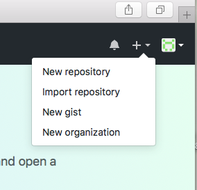
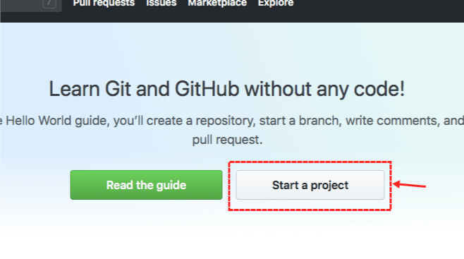
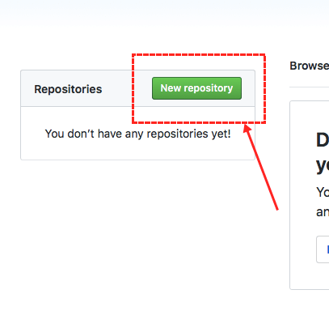
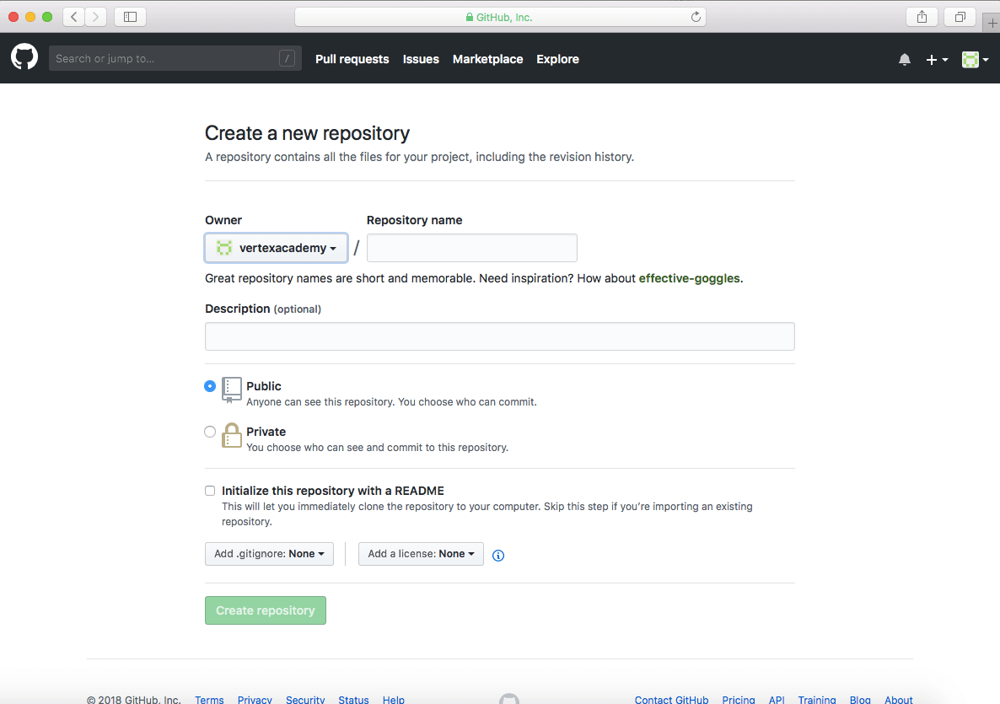
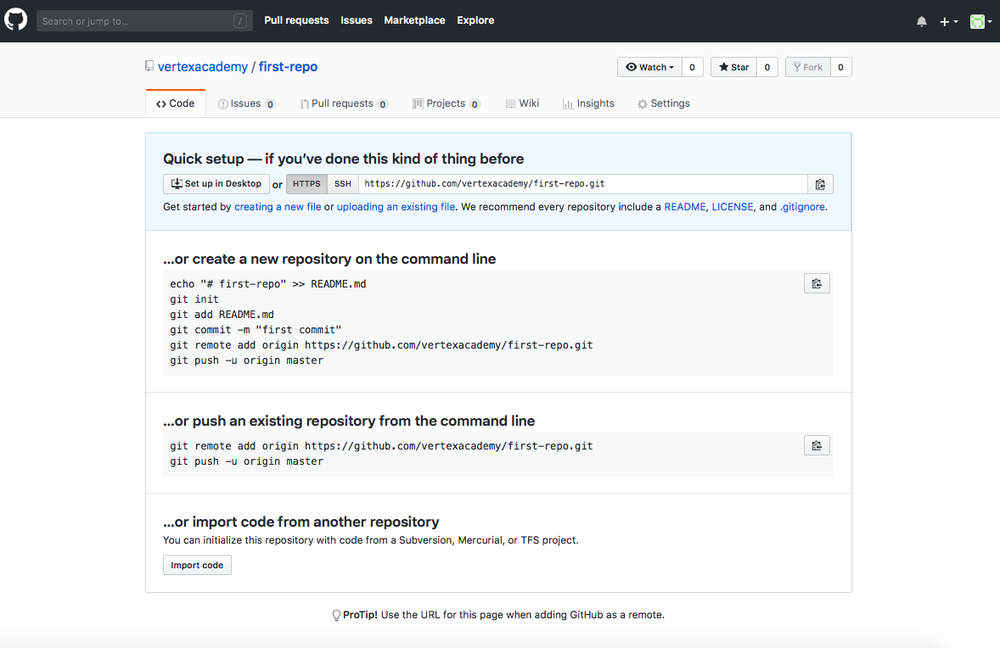

# Итоговая контрольная работа по основному блоку

## 1. Создать репозиторий на GitHub
Существует три способа создания репозитория на GitHub

**1 способ: Нажать на кнопку *"New repository"***

**2 способ: нажать на большую кнопку *"Start a project" ("Создать проект")***

**3 способ: нажать на зеленую кнопку *"New repository" ("Новый репозиторий") в окошке Repositories ("Репозитории")***

После создания репозитория мы должны увидеть вот такую страницу:

 Далее выполняем следующие пункты:
 + **Repository name** - имя репозитория 
 + Description - описание. Его писать не обязательно, но если нам необходимо, чтобы другой человек понял, о чём проект, то желательно подробно описывать проекты
 + Далее мы выбираем, что нам необходимо
   + Public - публичный доступ
   + Private - приватный доступ
+ Initialise this repository with a README (Создать репозиторий с README). README - это еще один способ рассказать людям, просматривающим Ваш репозиторий, о Вашем проекте.

Отлично, основные пункты пройдены. Значит жмём большую зелёную кнопку **CREATE REPOSITORY** и видим перед собой вот такую страницу:

Соблюдая одно из действий данной страницы мы можем закинуть на GitHub наш проект

--- 
