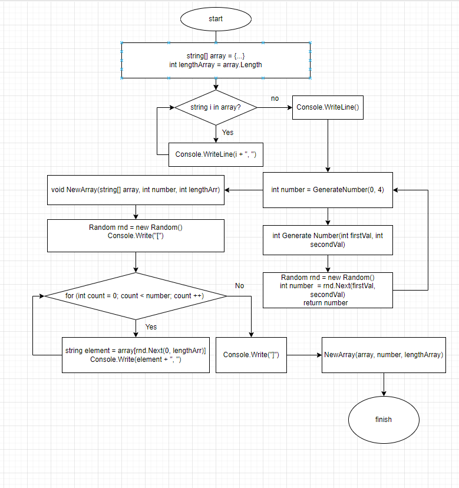

# Итоговая контрольная работа по основному блоку

## 1. Создать репозиторий на GitHub
Существует три способа создания репозитория на GitHub

**1 способ: Нажать на кнопку *"New repository"***


**2 способ: нажать на большую кнопку *"Start a project" ("Создать проект")***


**3 способ: нажать на зеленую кнопку *"New repository" ("Новый репозиторий") в окошке Repositories ("Репозитории")***


После создания репозитория мы должны увидеть вот такую страницу:

 Далее выполняем следующие пункты:
 + **Repository name** - имя репозитория 
 + Description - описание. Его писать не обязательно, но если нам необходимо, чтобы другой человек понял, о чём проект, то желательно подробно описывать проекты
 + Далее мы выбираем, что нам необходимо
   + Public - публичный доступ
   + Private - приватный доступ
+ Initialise this repository with a README (Создать репозиторий с README). README - это еще один способ рассказать людям, просматривающим Ваш репозиторий, о Вашем проекте.

Отлично, основные пункты пройдены. Значит жмём большую зелёную кнопку **CREATE REPOSITORY** и видим перед собой вот такую страницу:

Соблюдая одно из действий данной страницы мы можем закинуть на GitHub наш проект

--- 
## 2. Нарисовать блок-схему алгоритма



## 3. Описание решения задачи
***Задача: Написать программу, которая из имеющегося массива строк формирует новый массив из строк, длина которых меньше, либо равна 3 символам. Первоначальный массив можно ввести с клавиатуры, либо задать на старте выполнения алгоритма. При решении не рекомендуется пользоваться коллекциями, лучше обойтись исключительно массивами.***

1. Первым пунктом создаём основной метод **Main** типа **void**, в котором будет описываться основное решение
  + задаём массив имеющий тип **string**, то есть строковый тип данных, так как в данном массиве у нас содержатся как буквы, так цифры и элементы.
  + Далее при помощи цикла **foreach** перечитываем и выводим данный массив в консоль.
```c#
void Main()
{
    string[] array = {"Hello", "2", "world", ":-)", "1234", "1567", "-2", "computer science", "Russia", "Denmark", "Kazan"};
    int lengthArray = array.Length;
    foreach(string i in array)
    System.Console.Write(i + ", ");
}

Main();
```

  2. Далее нам нужно сгенерировать число элементов, что будут выводиться на экран из набора массива, которое по задаче должно быть от 0 до 3.
  + Для этого мы создаём новый метод **GenerateNumber** в аргументы которого по желанию можно передать числовой диапазон из которого будет выбираться однго число, однако в скобках по умолчанию уже указан диапазон от 0 до 3.
  + После чего, в теле функции мы записываем тело функции(метода)

```c#
int GenerateNumber(int firstVal = 0, int secondVal = 4)
{
    Random rnd = new Random();
    int number = rnd.Next(firstVal, secondVal);
    return number;
}
```
А также мы добавляем одну строку в главном методе MAIN() для вызова этого метода и задаём переменную, которая будет равна данному числу из диапазона от 0 до 3:
```c#
    int number = GenerateNumber(0, 4);
```
  3. Последним пунктом мы создаём ещё один метод, который учитывая цифру, которая была получена в предыдущем методе, будет выводить в консоль рандомные элементы из массива, в разной последовательности. То есть в данном методе мы опять используем ***RANDOM***
```c#
void NewArray(string[] array, int number, int lengthArr)
{
    Random rnd = new Random();
    System.Console.Write("[");
    for (int count = 0; count < number; count++)
    {
        string element = array[rnd.Next(0, lengthArr)];
        Console.Write(element + ", ");
    }
    System.Console.Write("]");
}
```

И так же в главном методе мы добавляем строку, в которой будем передавать необходимые аргументы в данный метод:
```c#
int lengthArray = array.Length;
NewArray(array, number, lengthArray);
```